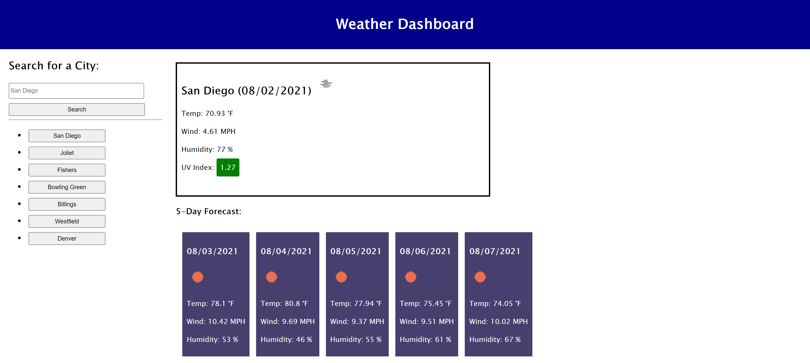

# 06-Server-Side-APIs--Weather_App
Weather App to enter location and get forecast

Very simple web app that allows you enter a location name and get the current weather and 5 day forecast, using the openweathermap API. Search history is also captured and stored in local storage for quick access to previous locations that have been looked up. 

Basic functionality: 
* User enters location and clicks search
* current weather and forecast is displayed
* location is added to search history
* search history is saved in local storage and remains if page is refreshed.
* user can click on previous search to load the weather
* when user clicks a previous search or enters a location that is already in the list, it is brought to the top of the list

Screenshot:

Links: 
* Repo - https://github.com/irv0735/06-Server-Side-APIs--Weather_App
* "Live Site" - https://irv0735.github.io/06-Server-Side-APIs--Weather_App/